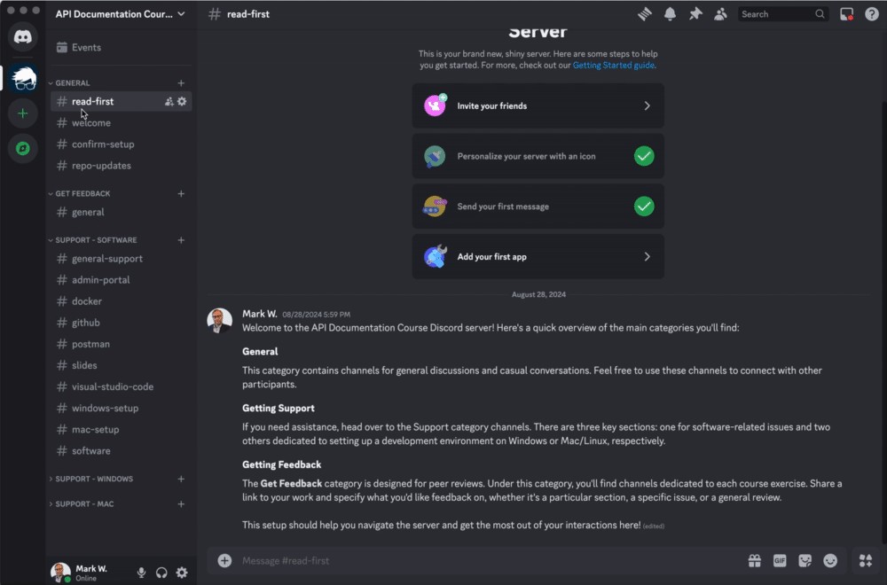
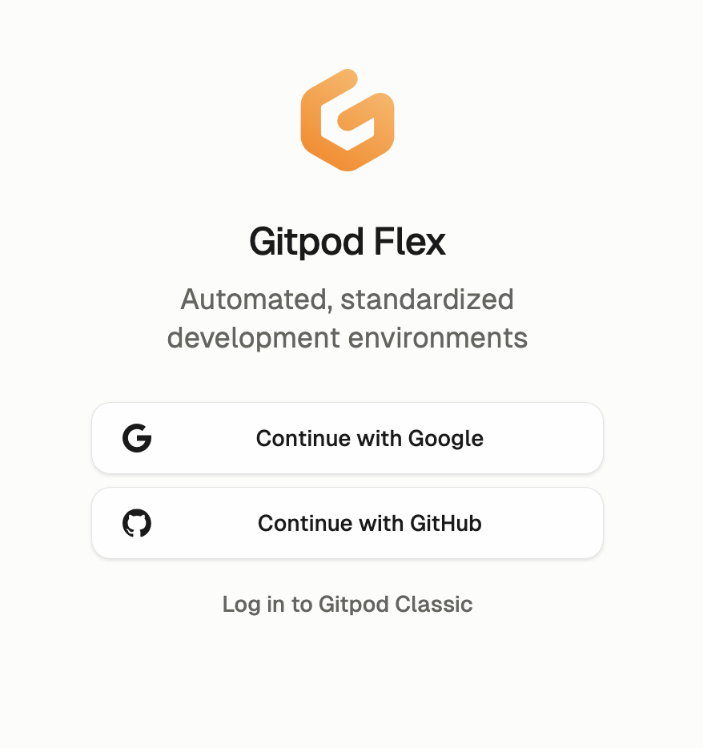
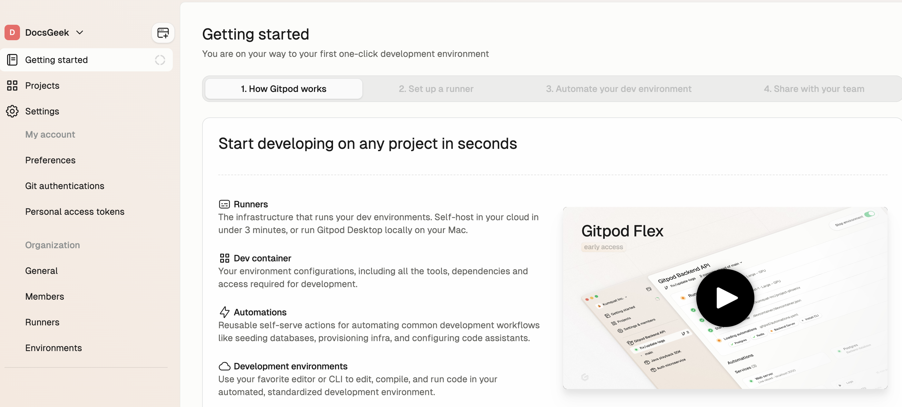
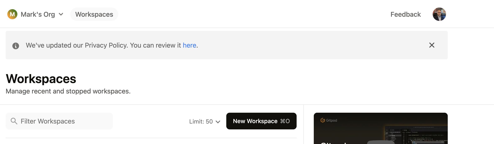
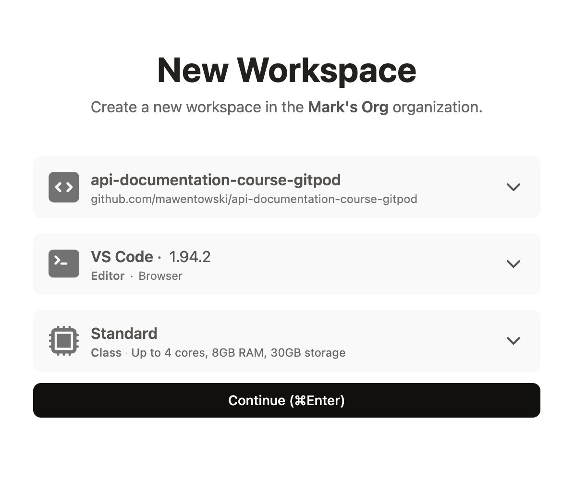
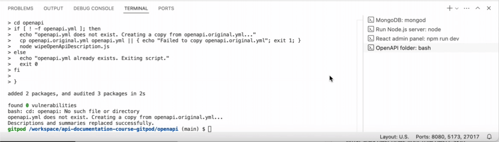

# API Documentation Course

Welcome to the API Documentation course! This repository contains everything you need to test and document the course API.

## About This Repository

This repository serves as an API development environment, providing all the necessary components to develop, test, and debug an API on your machine. Here, you'll find everything you need to work with the course API—referred to as the POS API (Point-of-Sale API). The repository includes a frontend interface, an API server, and a MongoDB database, along with other essential tools.

## Set up your Development Environment

### 1. Install Required Software for the Course

If you have not already, download the following applications (search for them using Google):

- **Discord**
- **Postman**
- **Google Chrome**

During a software installation, if you are prompted to create an account, do so.

---

### 2. Join the Discord Server

The Course Discord channel is used to:

<!-- Revise these -->

- Get technical support on issues encountered during setup or resolving issues that come up when doing exercises
- Solicit feedback from the teacher or other participants.
- Confirm you completed assignments to the instructor.
- Sharing documents related to the course like course assignments and final project guidelines
- Social reasons.

To join the Discord Server:

1. Open the **Discord** app you downloaded previously and sign in if needed.
2. Click the plus (**+**) icon on the left-side toolbar to add a server.
3. Select "Join a Server" under "Have an invite already?".
4. Paste the following URL into the "Invite Link" field:

   ```
   https://discord.gg/YucnPrkMMP
   ```

See the video below for reference:



You’ll be added to the course Discord channel where you can get support and ask questions as you set up your environment.

<!-- REORGANIZE DISCORD WELCOME PAGE -->
<!-- Within the **General** category, open the channel dedicated to your course schedule and introduce yourself. -->

If you encounter any issues, please email [mark.wentowski@docsgeek.io](mailto:mark.wentowski@docsgeek.io).

---

### 3. Sign Up for Gitpod

1. Visit the [Gitpod website](https://www.gitpod.io/) and sign up.
2. Click **Continue with Google** and create an account.

   

3. If prompted, click **Authorize gitpod-io**.

4. When prompted, create a personal organization (this is unrelated to the course). You can skip the questions regarding your role and Gitpod goals.

5. Once the authorization process is complete, you may be directed to the following screen. If so, then close this tab as you will not need it.

   

---

### 4. Access the Gitpod Workspaces Page

1. Open the [Gitpod Workspaces page](https://gitpod.io/workspaces). If prompted, log in to be redirected to the Workspaces page:

   

2. If you're unable to access the Workspaces page, visit the [Gitpod website](https://www.gitpod.io/). Look for the **Dashboard** button in the top-right corner and click it to load the Workspaces screen. Alternatively, visit [https://gitpod.io/workspaces](https://gitpod.io/workspaces) directly.

---

### 5. Open a GitPod Workspace

<!-- CHANGE REPO TO MAIN REPO-->

1. Open a workspace by clicking this URL: [https://gitpod.io/#https://github.com/mawentowski/api-documentation-course-gitpod](https://gitpod.io/#https://github.com/mawentowski/api-documentation-course-gitpod).

   You should see a screen like this:

   

2. Click **Continue**.
3. Wait for Gitpod to prepare the workspace. This may take a few minutes as it configures everything.

### 6. Test Your GitPod Workspace

Follow the steps in the [GitPod User Guide](./gitpod-user-guide.md). Ensure you can complete the steps described. Skip the last section, "IMPORTANT: Stopping the Workspace".

### 7. Importing Postman collections

First, copy the server URL the GitPod workspace. To do this, go to the bottom of the screen, click **Ports**, and click the copy button next to the Node.js server port address.



With the server URL copied to your clipboard, proceed to the next step by completing the [Postman setup instructions](./postman-setup-gitpod.md).

---

## Pinning the Workspace

GitPod workspaces are deleted in 15 days from the time of creation. To prevent this, and avoid doing the setup again, you have to **Pin** the workspace in GitPod.

To stop the workspace:

1. Go to [https://gitpod.io/workspaces](https://gitpod.io/workspaces).
2. Click the three dots (**⋮**) next to your active workspace and select **Pin**.

   

---

## Stopping the Workspace

Follow the instructions in the [GitPod User Guide](./gitpod-user-guide.md) > "IMPORTANT: Stopping the Workspace" secetion for stopping the workspace.

You have 50 free hours included with the GitPod Free Plan, which should be enough to cover the duration of the course IF you stop your workspace EVERY time you have completed an exercise.

It's important to stop the workspace when you're done working, whether after an exercise, demonstration, or when you're finished for the day.

---

## Completing the setup

By following the steps outlined in this guide, you will have successfully completed the Gitpod setup and are fully prepared to begin the course exercises.
