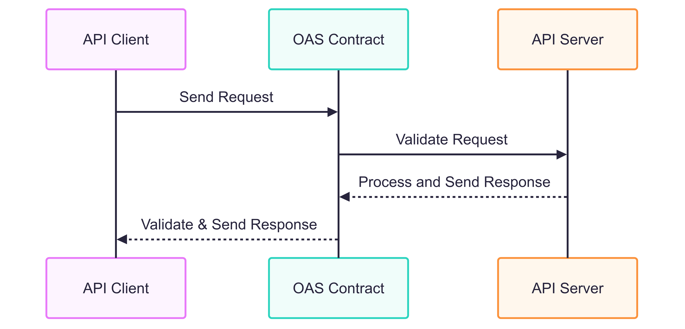
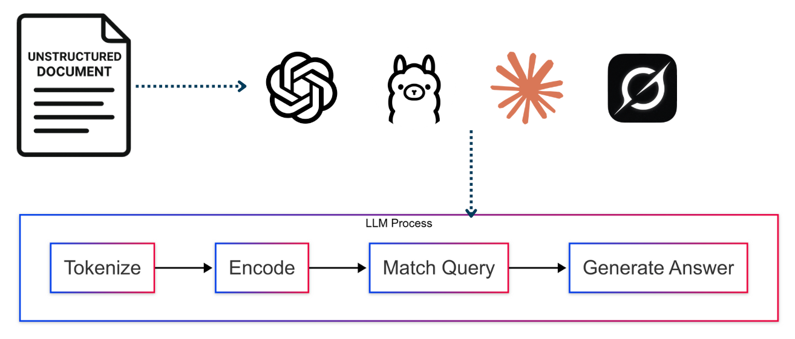
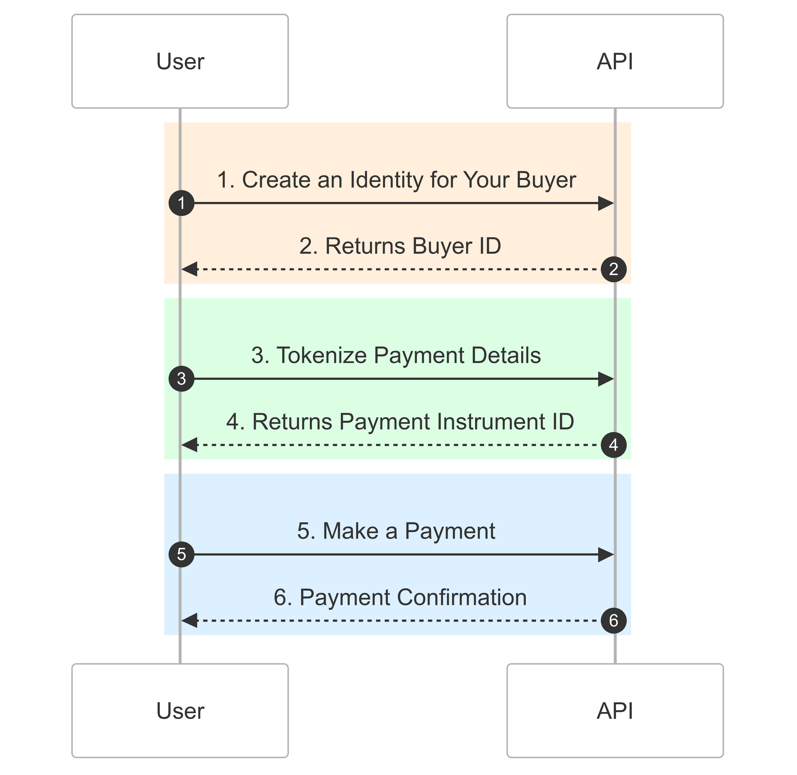
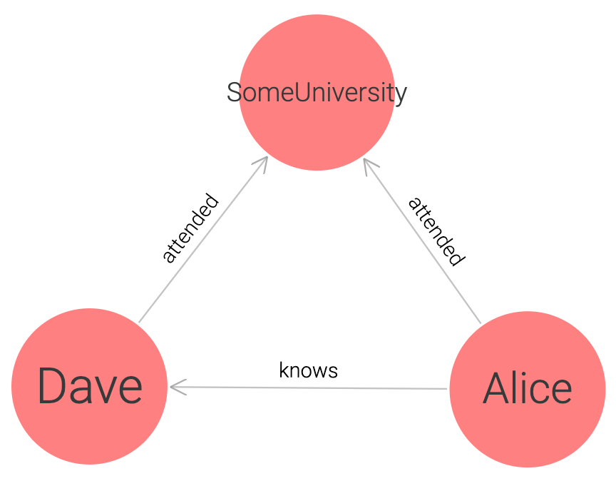
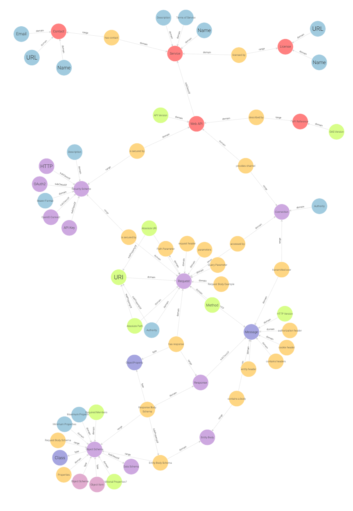
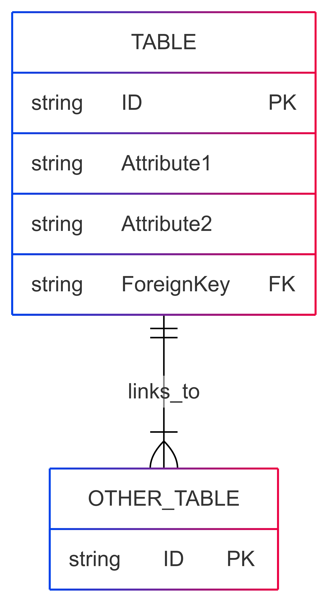
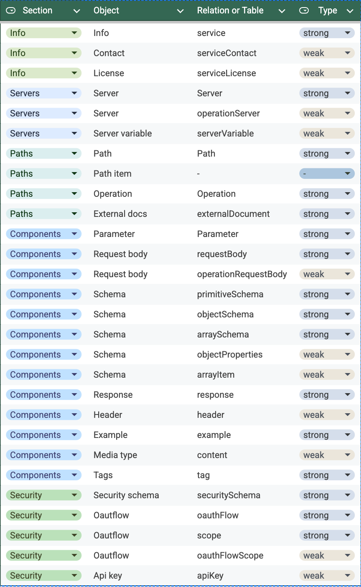
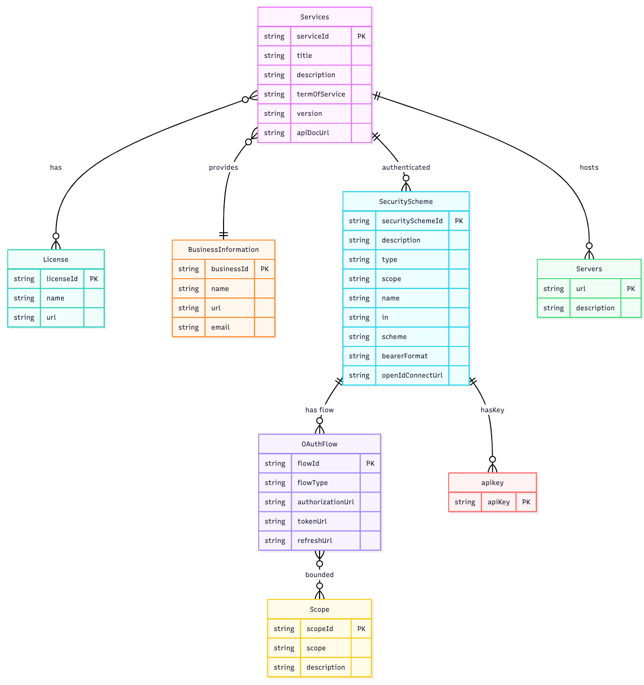
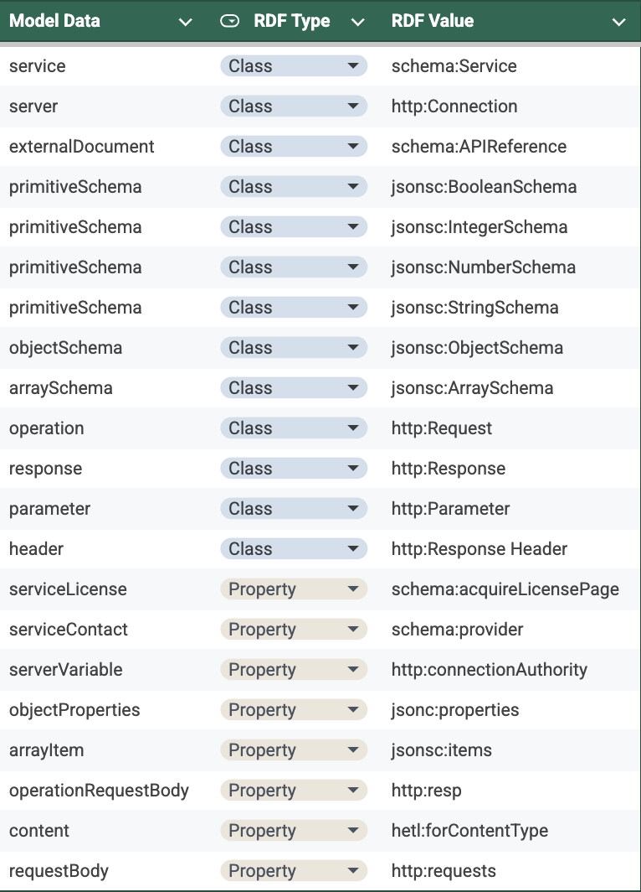
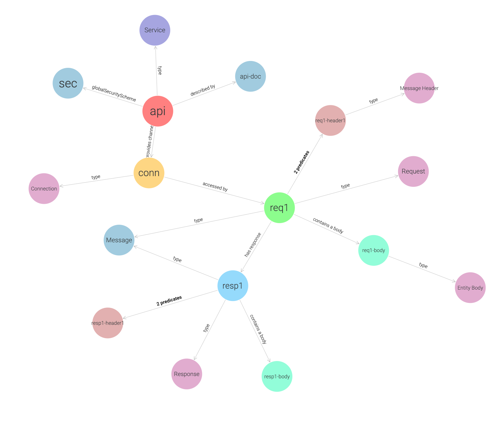

# Temp

<!-- # <u>From Static API Docs to Semantic APIs</u>:<br>_A Knowledge-Driven Approach to API Discoverability and Automation_ -->

## OpenAPI: A Common Language for APIs

In the world of APIs, we’ve had OpenAPI for some time. It helps create a common language for different web services, making it easier for a server and a client to work together, even if they’re built using different programming languages or systems. OpenAPI allows different software to understand each other better.


## Openapi: Specification And Documentation

OpenAPI is a helpful guide for understanding how an API works and sets rules for data handling.

It ensures the data clients send to servers is valid and vice versa.



<!--
**Remove escaped characters: \>
```mmd
sequenceDiagram
    participant Client as API Client
    participant OAS as OAS Contract
    participant Server as API Server
    Client->>OAS: Send Request
    OAS->>Server: Validate Request
    Server--\>>OAS: Process and Send Response
    OAS--\>>Client: Validate & Send Response
```
-->

Developers consult the API documentation when they have questions or need to add application features. For instance, if I wanted to add online payments to my app using a payment processing API, I would refer to the API documentation for how to do this, for example:

Using the OpenAPI specification requires considerable effort to navigate its components and find answers. You must understand the structure of OpenAPI to locate the appropriate sections containing the information you need.

```yaml
# Specifies the OpenAPI version.
openapi: '3.0.0'
# General API info: title, description, version, terms of service.
info:
  title: ''
  description: ''
  version: ''
  termsOfService: ''
  contact:
    name: ''
    url: ''
    email: ''
  license:
    name: ''
    url: ''
# Base URL(s) for the API.
servers:
  - url: ''
    description: ''
# Available API endpoints.
paths: {}
# Reusable elements like schemas, responses, parameters, security schemes.
components:
  schemas: {}
  responses: {}
  parameters: {}
  requestBodies: {}
  headers: {}
  securitySchemes: {}
# Security mechanisms for API access.
security: []
# Groups API endpoints.
tags: []
# Links to related external documentation.
externalDocs:
  description: ''
  url: ''
```

## Querying OAS with LLMs

With the rise of large language models (LLMs), we can now assist users in discovering APIs and understanding their capabilities. These models also guide composing API requests, known as service composition, a step-by-step method for achieving specific goals.

However, OpenAPI, in its current form, is not well-suited to LLMs.

## The Struggle with Structured Input

The primary challenge is that LLMs excel at processing unstructured data, which is their optimal mode of operation. In contrast, the OpenAPI specification consists of structured data—that is, metadata following a specific schema.



<!--
```mmd
flowchart TB
 subgraph s1["LLM Process"]
        A["Tokenize"]
        B["Encode"]
        C["Match Query"]
        D["Generate Answer"]
  end
    A --\> B
    B --\> C
    C --\> D
```
-->

This structured aspect makes OpenAPI powerful as a standard; if your API follows REST principles, it can be described using the OpenAPI schema, allowing you to generate docs, among other things.

LLMs are not optimized for large-scale data processing. Since OpenAPI specifications can be highly complex—sometimes comprising up to 100,000 lines—feeding this entire file into an LLM is inefficient and costly. LLMs also have token limitations; for example, they might only process data with fewer than 120,000 tokens, making it expensive to handle documents with a high token count.

It is not practical to give a language model a raw JSON or YAML OpenAPI file. A better approach would be to provide the OpenAPI specification first so the model can create and save **embeddings**. These embeddings can then be accessed later when needed.

Embedding is a way to turn text into numbers that allow the user to compare and find similar information to the query.

## Token Limit Errors

LLMs are not optimized for large-scale data processing. Since OpenAPI specifications can be highly complex—sometimes comprising up to 100,000 lines—feeding this entire file into an LLM is inefficient and costly. LLMs also have token limitations; for example, they might only process data with fewer than 120,000 tokens, making it expensive to handle documents with a high token count.

1. Feed OAS to LLM as text:

```shell
openai api chat.completions.create -m gpt-4 -g user \
-p "How do I make an online payment: $(cat oas.txt)"
```

2. Token limit error encountered:

```shell
Error: The input text exceeds the maximum token limit of 125000 tokens for this model. Please shorten the input text or use a model with a higher token limit.
```

## Token Limit Workaround: Embeddings

It is not practical to give a language model a raw JSON or YAML OpenAPI file. A better approach would be to provide the OpenAPI specification first so the model can create and save **embeddings**. These embeddings can then be accessed later when needed.

Embedding is a way to turn text into numbers that allow the user to compare and find similar information to the query.

```python
# Step 1: Generate embeddings for each OAS section:
def create_embedding_store(sections):
  return {section: get_embedding(section) for section in sections}

# Step 2: Load OpenAPI YAML and Extract Sections
def load_openapi_yaml(file_path):
    with open(file_path, "r") as file:
        return yaml.safe_load(file)

def extract_sections(openapi_spec):
    # insert logic here
    return sections

# Step 3: Get Embeddings for Each Section
def get_embedding(text):
    response = openai.Embedding.create(
        model="text-embedding-ada-002",
        input=text
    )
    return response["data"][0]["embedding"]

# Step 4: Store Embeddings in Memory
def create_embedding_store(sections):
    return {section: get_embedding(section) for section in sections}
```

## Transformation Issues: Losing Explicit Relationships

However, there are notable disadvantages. The structure, schema, and syntax of the original OpenAPI document are not retained; only the bits of text transformed into vectors are available. Consequently, we are not querying the "contract" itself, but rather bits of text extracted from it. The OpenAPI file defines explicit relationships between entities, which are lost in this process.

For example, when querying an API specification for "authentication," embeddings might retrieve endpoints that mention security, such as:

```yaml
paths:
  /auth/token:
    post:
      summary: Authenticate user and obtain a access token
      description: |
        This operation exchanges the user's username and password
        directly for an access token. The client ID and client secret 
        are used for client authentication (basic).
```

But miss those that actually require authentication:

```yaml
paths:
  /orders:
    post:
      summary: Create an order
      operationId: postOrder
      security:
        - AccessToken: []
components:
  securitySchemes:
    AccessToken:
      type: http
      scheme: bearer
```

It’s essential to maintain these explicit relationships in the source data for the LLM.

What was overlooked is that there is no concept of a "security scheme", and specific requests require certain security schemes. As a result, it performed a similarity search and found text containing the term. Still, it did not provide the correct answer based on the explicit relationships between security schemes and requests defined in the OAS file. Unfortunately, this information was lost during the conversion.

## Opaque Reasoning in Embeddings

As mentioned earlier, a core objective of this effort is to expose the process by which an LLM answers a query, specifying how to compose an API request to achieve the desired result.

The issue with embeddings is that we will never know **why** a piece of information was retrieved, as there is no human-readable reasoning or explainability; the reasoning remains opaque.

Additionally, this method is not maintainable; when your API changes, you must reprocess the entire OpenAPI file to generate new embeddings, as we cannot selectively update certain parts.

## Native OAS Limitations

Moving away from LLMs for a moment, OAS itself provides some limitations.
OAS documents primarily focus on syntax, emphasizing the **structure** and **format** of an API. This is adequate for queries seeking specific information but falls short regarding business concepts.

For example, a developer may ask how to send an API call to process an online payment. The LLM may struggle to link the business concept "online payment" in the query with the relevant API resources needed to fulfill the user's request.

The LLM does not understand that this requires a multi-step process involving separate API endpoints executed in a specific order:



<!--
```mmd
sequenceDiagram
    autonumber
    participant User
    participant API

    rect rgba(255, 223, 186, 0.5)
    User-\>>API: 1. Create an Identity for Your Buyer
    API--\>>User: 2. Returns Buyer ID

    end

    rect rgba(186, 255, 201, 0.5)
    User-\>>API: 3. Tokenize Payment Details
    API--\>>User: 4. Returns Payment Instrument ID
    end

    rect rgba(186, 225, 255, 0.5)
    User-\>>API: 5. Make a Payment
    API--\>>User: 6. Payment Confirmation
    end

```
-->

Endpoints have dependencies and relationships, meaning IDs returned in responses are necessary for subsequent requests. In the previous API flow, steps 2 and 3 relied on passing specific resource IDs, as demonstrated by the Swagger UI buttons in your API documentation course.

## Different representations of the same resource

The centrally defined concept of "online payment" lacks explicit connections between different parts of the OAS specification, making it difficult to see that they all refer to the same idea. This concept corresponds to an API resource with various endpoints, parameters, and related schemas.

## Describing APIs Semantically

So far, we've focused on answering queries based on the syntax defined in an OAS specification. However, we must describe APIs semantically to provide meaningful answers to user queries. What's the difference between syntax and semantics?

Syntax establishes the structure and rules of a programming language, ensuring the code is correctly written so it can run.

Semantics deals with the meaning and logic of the code—while syntactically correct code may run, flawed semantics can lead to incorrect behavior.

Important quote:
Describing APIs semantically entails relating API resources to the real-world resources they represent, conveying meaning, relationships, and context about the data.

Understanding the "meaning of the data" is crucial, not just the syntax required to retrieve it and the structure of what is returned. Without semantic meaning, the LLM's ability to answer queries will be limited.

In summary, OpenAPI Specification (OAS) outlines the structure of an API. Still, it does not provide the necessary information for a language model to answer questions about the business sectors connected to that API.

### Putting It All Together: Defining the End Goal

Let's outline our goals for describing APIs semantically based on our discussions:

1. Preserve the explicit relationships in the OpenAPI Specification (OAS) to ensure it remains an inviolable contract, even for machine learning models.
2. Connect API resources to real-world entities to relate query identifiers with their corresponding resources and components in the OAS.

### Leveraging the Semantic Web

To address this, we need a method to make APIs more semantic, facilitating efficient information retrieval. Instead of reinventing the wheel, we can leverage concepts already embedded in the fabric of the web, known collectively as the "semantic web." There is a significant relationship between the semantic web and REST APIs, particularly in the concept of the "resource."

The Semantic Web is an extension of the World Wide Web that organizes internet data in standard formats, making it easier for computers to read. Instead of just unstructured web pages, it connects data as "resources" identified by URIs. Users can access pages about specific people, ideas, or objects, which include data that machines can understand.

The basic unit of the Semantic Web is a triple, consisting of a subject, predicate, and object.

```xml
<http://example.com/person/Alice> <http://xmlns.com/foaf/0.1/name> "Alice" .
```

These resources are organized into groups with specific characteristics, described by a "vocabulary." A vocabulary can be a collection of terms and definitions that help us describe different types of things, their properties, and their relationships to other things.

%% Not sure I want to add a vocabulary example %%

The goal is to create a network of "things" that connect and reference each other, allowing machines to understand and share information from various sources in a helpful and automated way. This network can be visualized as a knowledge graph, which shows how different resources relate.



The following is the process for generating the previous knolwedge graph:

1. Define Alice:

```xml
<http://example.com/person/Alice> <http://xmlns.com/foaf/0.1/name> "Alice" .
```

2. Define Dave:

```xml
<http://example.com/person/Dave> <http://xmlns.com/foaf/0.1/name> "Dave" .

```

3. Define the College as a node:

```xml
<http://example.com/college/SomeUniversity> <http://xmlns.com/foaf/0.1/name> "Some University" .
```

4. Create a relationship (e.g., went to the same college) between Alice and Dave:

```xml
<http://example.com/person/Alice> <http://example.com/ontology/attended> <http://example.com/college/SomeUniversity> .
<http://example.com/person/Dave> <http://example.com/ontology/attended> <http://example.com/college/SomeUniversity> .

```

While the vision of the semantic web hasn’t come to life as anticipated, we can use the many tools and standards developed:

- RDF (Resource Description Framework):<br>
  A framework for representing structured information on the web.

- SPARQL<br>
  A query language for querying RDF data.

- R2RML (RDB to RDF Mapping Language)<br>
  A language used for mapping relational database schemas to RDF.

- OWL (Web Ontology Language)<br>
  A language for defining and instantiating ontologies in the Semantic Web.
- SHACL (Shapes Constraint Language)<br>
  A language for validating RDF data against a set of conditions (shapes).

- Vocabularies:<br>
  - FOAF (Friend of a Friend): A vocabulary for describing people, their activities, and their relations to other people and objects.
  - FIBO (Financial Industry Business Ontology): An ontology for representing financial industry concepts, particularly those related to financial services.

---

### Querying Knowledge Graphs

Nowadays, language models can query knowledge graphs.

If we could represent an API as a knowledge graph, we could keep the explicit relationships defined in the OAS that were lost during the embedding process we discussed earlier. We can also add business concepts to enrich the graph.

The semantic web centers around the concept of a resource. API resources represent real-world "things," though OAS does not explicitly define them as such. By connecting API resources to their real-world counterparts, we could represent these and other structures within OAS as a queryable knowledge graph.

A successful response to a query should identify the entities within it, potentially using Named Entity Recognition (NER), and map these real-world concepts to their corresponding API resources. This ensures that the answer connects the user’s intent with the right actions and resources in the API.

The LLM cannot depend on context or similarity search because the term "online payment" isn't explicitly mentioned in the endpoint documentation. Instead, in the API context, "online payment" is represented as a "transfer." This is what we mean by making APIs semantic—ensuring that the meaning and intent of terms are properly mapped to the appropriate resources and actions within the API.

The key challenge is to develop a system for converting OAS specifications into knowledge graphs.

### A vocabulary for discussing APIs

Let's focus on the first goal of maintaining the explicit relationships defined in OAS that were lost with embeddings.

The first step is to establish a common vocabulary that helps us discuss a REST API in terms of the semantic web. This vocabulary will define various aspects of the API, like requests, parameters, and responses. We can use existing vocabularies to help with this and customize them as needed. This new vocabulary will illustrate the relationships between different API parts while keeping connections from the original OAS files intact.

Next, we’ll explore the vocabulary within an Ontotext database, starting from the overarching structure of the REST API and breaking it down into finer details.



Now that we have a vocabulary for discussing semantic APIs, we need a program that pulls OAS-defined entities and maps them to the classes and properties defined in our vocabulary. The relationships between these entities will be formed based on our vocabulary. For instance, a request will be linked to certain parameters and a specific response. The vocabulary will guide us in defining these connections, and our job is to correctly match the entities to the classes and properties in the OAS. This way, the vocabulary will handle the relationships for us.

Translating OpenAPI Specification (OAS) documents into semantic web language has been a focus of active research for some time, employing various techniques.

Tom Hughes's paper "Transforming OpenAPI 3.0 to RDF-Based Semantic Web Services " outlined a notable approach. The paper describes a series of steps for converting the OAS specification into an RDF dataset or the source code for knowledge graphs that can be visually uploaded to a knowledge graph database.

While the paper provided limited details on implementing a solution for this transformation, we can use the high-level steps described as a guide to develop our solution.

## Intermediate step: Database

Due to the complexity of the process, we cannot directly convert OAS data into RDF. Instead, we first extract metadata into relational database tables before transforming this data into RDF. Using database tables as an intermediary is logical, as relational database structures can be easily mapped to RDF.

To illustrate this, consider a database table representing a class in RDF, as tables typically contain lists of entities of the same type. Each record corresponds to an individual entity identified by an ID, which can be considered a URI in RDF. The columns in the table represent attributes that can be mapped to RDF properties. A cell contains a value that corresponds to a literal in RDF. Additionally, a foreign key column represents a relationship between entities and can be seen as a link to another resource identified by a URI.



## Mapping OAS to Database Tables

To analyze the structure of the OAS, we interpret the objects identified in the OAS specification as database tables. Object properties are mapped to columns (attributes) of the table, while the property values represent the corresponding data entries.



"Muhamad et al. - 2020 - Designing Semantic Web Service Based on OAS 3.0 through Relational Database"

Some objects translate into multiple tables, whereas others, like path items, do not. Path items mainly group operations' components, so only their subcomponents are converted into tables.

## Designing the Database Schema

After analyzing the OAS structure, we identified what tables need to be created and what columns and attributes must be included in those tables. This process resulted in a database schema design:



"Muhamad et al. - 2020 - Designing Semantic Web Service Based on OAS 3.0 through Relational Database"

## Extract Metadata from OAS

Now that a database schema has been created, we need a system to extract metadata from any OAS specification into the appropriate tables based on the database schema. We determined that 27 tables are necessary to store the data from the OpenAPI specification.

The simplest method is for a program to loop through the various high-level sections of the OAS specification, saving data as records in the appropriate database tables according to the schema.

The high-level sections to be converted include the info, servers, security, paths, tags, externalDocs, and components sections of the OAS specification.

## Convert Extracted Data to RDF

After we extract the data into the database tables, the next step is to convert this data to RDF.

To facilitate this process, we can leverage a tool designed for the semantic web specifically for converting database data into RDF triples, referred to as R2RML, a W3 recommendation for this purpose. You can use R2RML to map the objects extracted from the OAS specification to RDF classes:



After executing the R2RML, RDF triples are generated from the OAS specification. The data is now in RDF format:

```xml
<http://data.example.com/oas/arrays/13> <http://ont.morphapi.io/jsonsc#hasParentArray> <http://data.example.com/oas/arrays/8> .
<http://data.example.com/oas/arrays/13> <http://www.w3.org/1999/02/22-rdf-syntax-ns#type> <http://www.w3.org/2019/wot/json-schema#ArraySchema> .
<http://data.example.com/oas/objects/12> <http://ont.morphapi.io/jsonsc#hasParentArray> <http://data.example.com/oas/arrays/7> .
```

### Generating a Knowledge Graph From the RDF

We can now upload these RDF triples to a knowledge graph database to visually explore the resulting knowledge graph and even query it.



## Enriching the Knowledge Graph with Business Concepts

We now have what the language model needs to answer questions about API syntax. However, as previously mentioned, to be an effective data source, we must give meaning to API resources by relating them to the real-world objects they represent. Although API resources in the OAS correspond to real-world objects, the language model does not inherently recognize this connection. The resources described in the OAS focus more on structure than real-world meaning; they do not point to actual entities or their characteristics.

We need to transform our API into a semantic one to address this. This involves adding a layer of real-world concepts that relate to the API’s structure.

We can use existing ontologies to give meaning to API resources. For example, FIBO standardizes financial data, Schema.org is used for general web data, SIO supports scientific and healthcare data, and SOSA/SSN is useful for IoT-related APIs. These ontologies make it easier for different systems to understand and work with the same data.

## In conclusion

In conclusion, OAS specifications provide a valuable dataset that enables LLMs to retrieve information and interact with API resources—such as creating, updating, or deleting them—and orchestrate API calls for complex workflows (service composition). For developers integrating an API, an LLM can reveal the specific API calls it makes to execute these workflows, offering clear guidance on implementing them within their applications.

However, LLMs struggle to consume OAS directly because it is structured data. Simply using embeddings discards the explicit relationships defined in OAS, weakening its role as a contract. Converting OAS into a knowledge graph allows LLMs to query it effectively. By layering business concepts and semantics on top of the syntax, we can provide LLMs with a more complete and meaningful dataset for answering natural language queries.

If you're interesting in providing feedback on the first publicly availavble version of the tool, you can sign up here:
