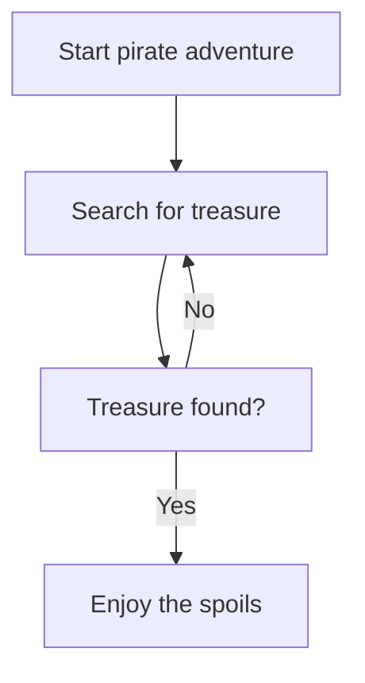
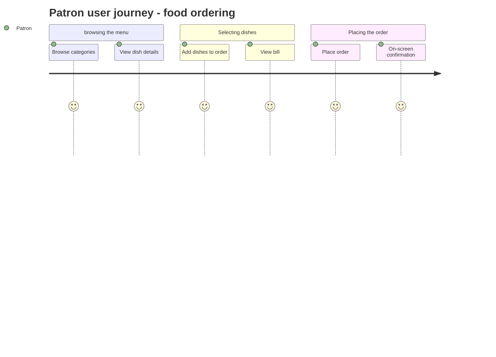
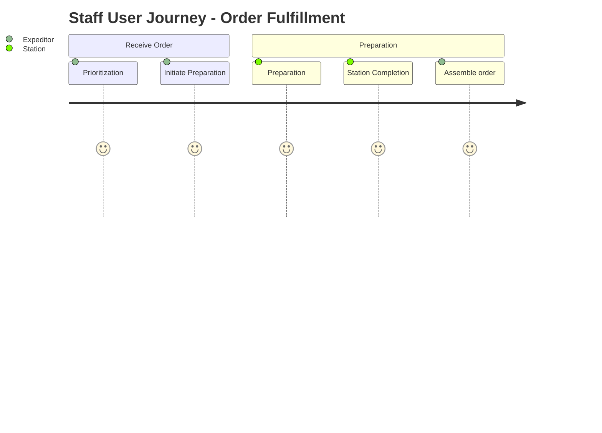
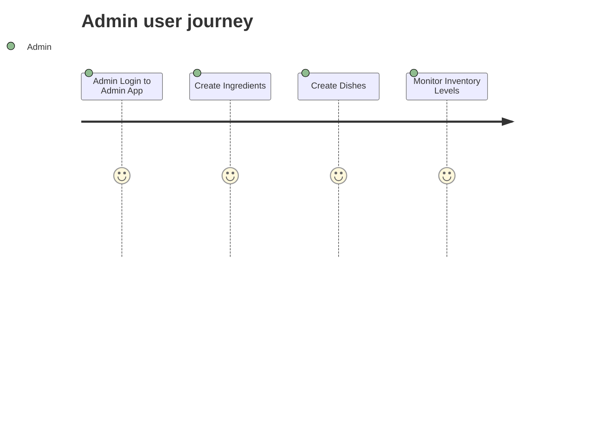

# Teacher aid

## Demo: Mermaid basic features

## Demo & Code-along: Diagram the patron user journey verbatin

## Codealong: Diagram the staff user journey verbatim

## Codealong: Diagram the admin user journey verbatim

Open Chrome Developer Tools, and in the **Network** tab, clear previous entries (click the icon with a circle and slash).

After saving, new network entroes should appear in **Chrome Developer Tools**. Locate the one related to

under the **Network** tab: `<code>{;} ingredients</code>`.

Crostini di Fegato
Lasagna alla Bolognese
Gelato
