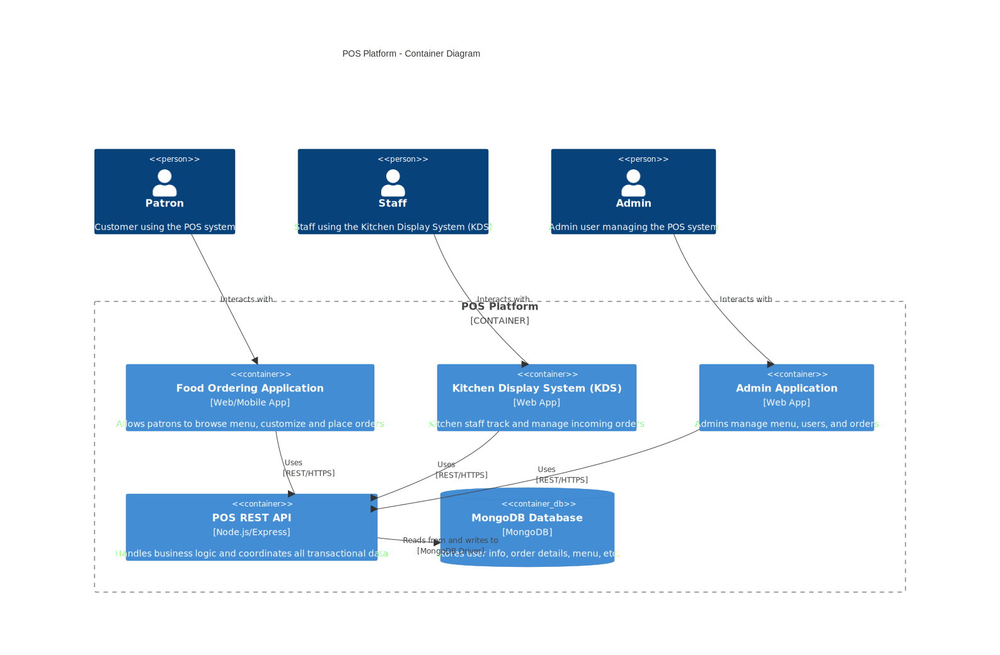

# Software Architecture

The C4 diagram for the "POS Platform" illustrates the high-level architecture of the system, detailing the interactions between users, applications, the API, and the database.

Here’s a breakdown of what each component represents and how they relate to one another:

## User (Patron, Admin, Staff)

This is the primary user group interacting with the system. It encompasses different types of users, including patrons (customers), admins (managers), and staff (employees).

## POS Platform

The central software system that serves as the core for all operations. It contains various components (containers) that facilitate different functionalities for users.

## Frontend Applications

There are three main applications within the POS Platform:

- **Food Ordering Application**: Allows patrons to browse the menu, customize orders, and place food orders.
- **Kitchen Display System (KDS)**: Used by kitchen staff to track the status of incoming orders, ensuring efficient meal preparation and order fulfillment.
- **Admin Application**: Utilized by admin users to manage the system, including menu setup, user management, and order oversight.

## POS REST API

Acts as the intermediary between the frontend applications and the database. Each frontend application sends requests to the API to perform various operations, such as placing orders or retrieving data.

### MongoDB Database

This is where all the application data is stored. The API reads from and writes to this database, handling tasks like saving order details, user information, and menu items.

### Relationships

- **User to POS Platform**: Users interact with the POS Platform, indicating their role in accessing the system.
- **POS Platform to Frontend Applications**: The diagram shows that the POS Platform contains the three frontend applications.
- **Frontend Applications to API**: Each application sends requests to the POS REST API for data processing and retrieval.
- **API to Database**: The API manages data storage and retrieval, ensuring that the applications have access to the necessary information.
