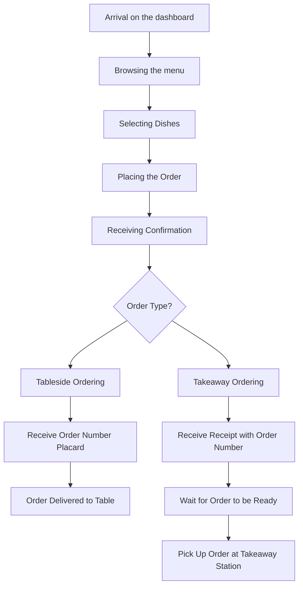
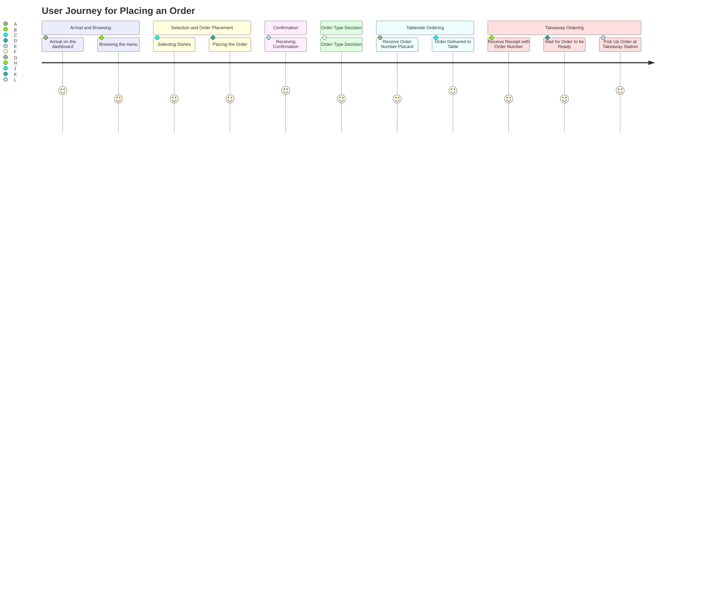
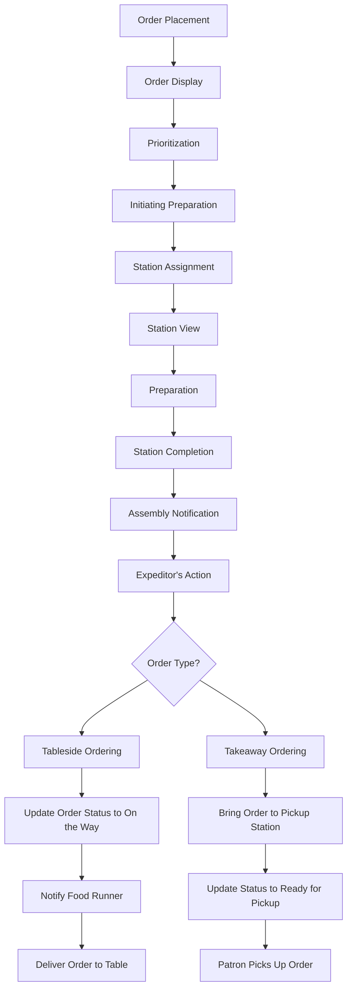
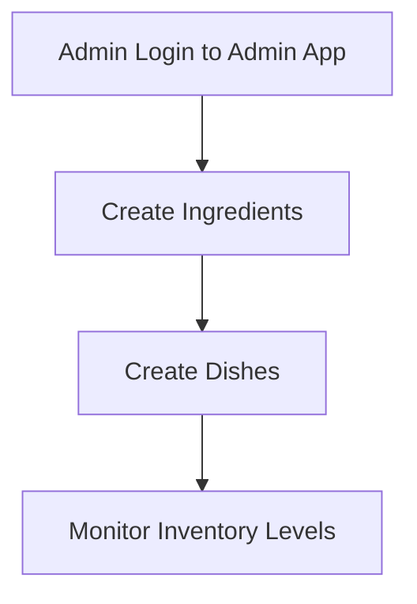

# User journey diagrams

## Patron user journey

```mermaid
graph TD
  A[Arrival on the dashboard] --> B[Browsing the menu]
  B --> C[Selecting Dishes]
  C --> D[Placing the Order]
  D --> E[Receiving Confirmation]
  E --> F{Order Type?}
  F --> G[Tableside Ordering]
  F --> H[Takeaway Ordering]

  G --> I[Receive Order Number Placard]
  I --> J[Order Delivered to Table]

  H --> K[Receive Receipt with Order Number]
  K --> L[Wait for Order to be Ready]
  L --> M[Pick Up Order at Takeaway Station]
```

```mermaid
journey
    title User Journey for Placing an Order
    section Arrival and Browsing
      Arrival on the dashboard: 5: A
      Browsing the menu: 4: B
    section Selection and Order Placement
      Selecting Dishes: 4: C
      Placing the Order: 4: D
    section Confirmation
      Receiving Confirmation: 5: E
    section Order Type Decision
      Order Type Decision: 4: F
    section Tableside Ordering
      Receive Order Number Placard: 4: G
      Order Delivered to Table: 5: J
    section Takeaway Ordering
      Receive Receipt with Order Number: 4: H
      Wait for Order to be Ready: 4: K
      Pick Up Order at Takeaway Station: 5: L

```

## Staff user journey

```mermaid
graph TD
  A[Order Placement] --> B[Order Display]
  B --> C[Prioritization]
  C --> D[Initiating Preparation]
  D --> E[Station Assignment]
  E --> F[Station View]
  F --> G[Preparation]
  G --> H[Station Completion]
  H --> I[Assembly Notification]
  I --> J[Expeditor's Action]
  J --> K{Order Type?}

  K --> L[Tableside Ordering]
  K --> M[Takeaway Ordering]

  L --> N[Update Order Status to On the Way]
  N --> O[Notify Food Runner]
  O --> P[Deliver Order to Table]

  M --> Q[Bring Order to Pickup Station]
  Q --> R[Update Status to Ready for Pickup]
  R --> S[Patron Picks Up Order]

```

## Admin user journey

```mermaid
graph TD
  A[Admin Login to Admin App] --> B[Create Ingredients]
  B --> C[Create Dishes]
  C --> D[Monitor Inventory Levels]
```
