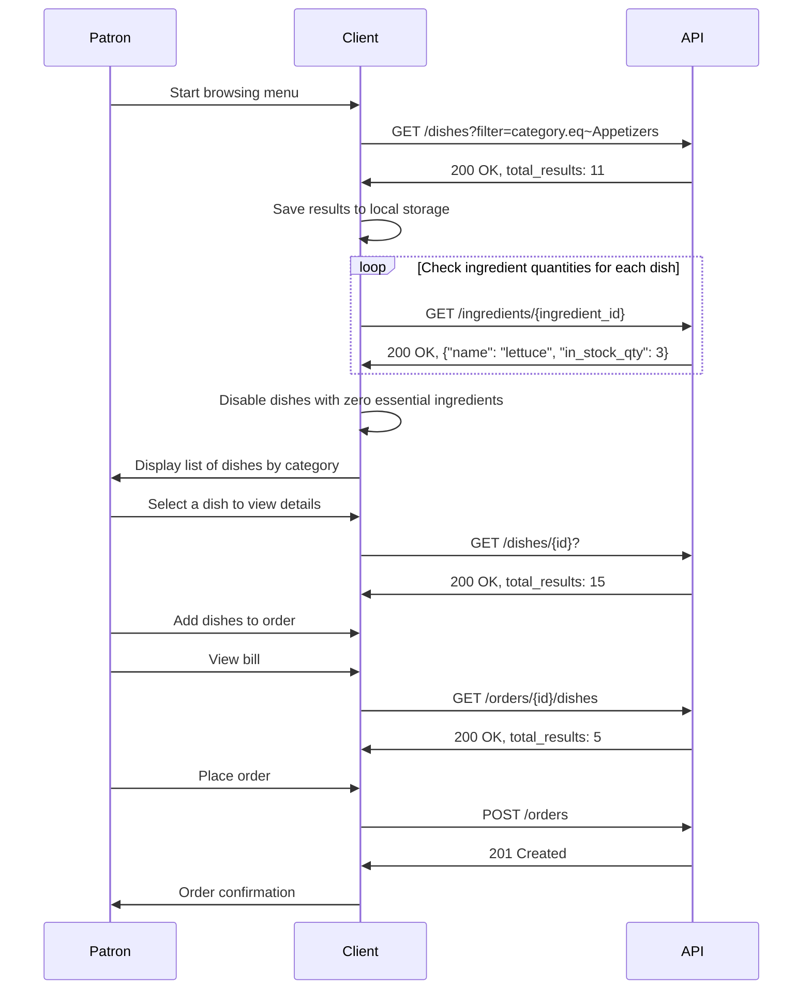
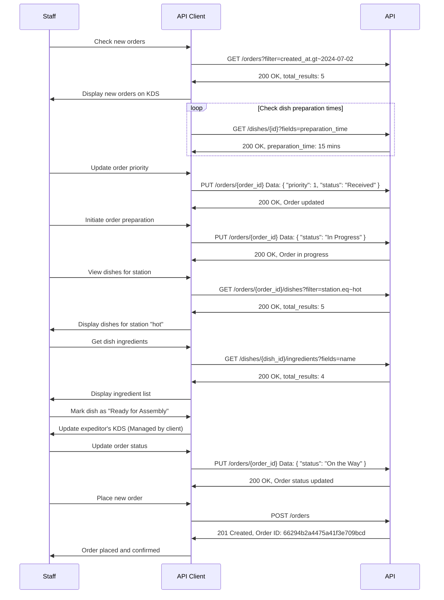
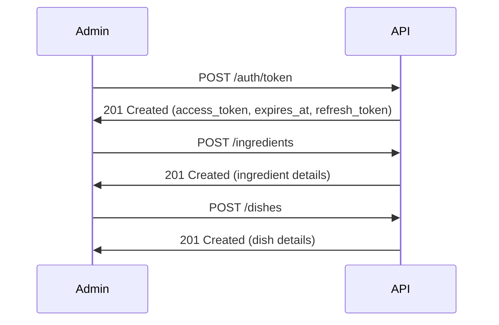
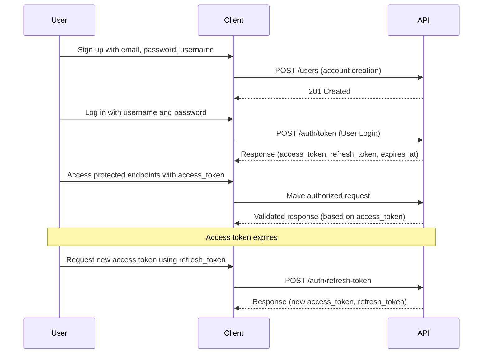

See docs/sessions/4/source-materials/diagrams/api-flows

## Patron API flow sequence diagram

```mermaid
sequenceDiagram
    participant Patron as Patron
    participant Client as Client
    participant API as API

    Patron->>Client: Start browsing menu
    Client->>API: GET /dishes?filter=category.eq~Appetizers
    API->>Client: 200 OK, total_results: 11
    Client->>Client: Save results to local storage

    loop Check ingredient quantities for each dish
        Client->>API: GET /ingredients/{ingredient_id}
        API->>Client: 200 OK, {"name": "lettuce", "in_stock_qty": 3}
    end
    Client->>Client: Disable dishes with zero essential ingredients

    Client->>Patron: Display list of dishes by category
    Patron->>Client: Select a dish to view details
    Client->>API: GET /dishes/{id}?
    API->>Client: 200 OK, total_results: 15

    Patron->>Client: Add dishes to order
    Patron->>Client: View bill
    Client->>API: GET /orders/{id}/dishes
    API->>Client: 200 OK, total_results: 5

    Patron->>Client: Place order
    Client->>API: POST /orders
    API->>Client: 201 Created

    Client->>Patron: Order confirmation
```

## Staff API flow

```mermaid

sequenceDiagram
    participant Staff as Staff
    participant Client as API Client
    participant API as API

    Staff->>Client: Check new orders
    Client->>API: GET /orders?filter=created_at.gt~2024-07-02
    API->>Client: 200 OK, total_results: 5
    Client->>Staff: Display new orders on KDS


    loop Check dish preparation times
        Client->>API: GET /dishes/{id}?fields=preparation_time
        API->>Client: 200 OK, preparation_time: 15 mins
    end

    Staff->>Client: Update order priority
    Client->>API: PUT /orders/{order_id} Data: { "priority": 1, "status": "Received" }
    API->>Client: 200 OK, Order updated

    Staff->>Client: Initiate order preparation
    Client->>API: PUT /orders/{order_id} Data: { "status": "In Progress" }
    API->>Client: 200 OK, Order in progress

    Staff->>Client: View dishes for station
    Client->>API: GET /orders/{order_id}/dishes?filter=station.eq~hot
    API->>Client: 200 OK, total_results: 5
    Client->>Staff: Display dishes for station "hot"

    Staff->>Client: Get dish ingredients
    Client->>API: GET /dishes/{dish_id}/ingredients?fields=name
    API->>Client: 200 OK, total_results: 4
    Client->>Staff: Display ingredient list

    Staff->>Client: Mark dish as "Ready for Assembly"
    Client->>Staff: Update expeditor's KDS (Managed by client)

    Staff->>Client: Update order status
    Client->>API: PUT /orders/{order_id} Data: { "status": "On the Way" }
    API->>Client: 200 OK, Order status updated

    Staff->>Client: Place new order
    Client->>API: POST /orders
    API->>Client: 201 Created, Order ID: 66294b2a4475a41f3e709bcd
    Client->>Staff: Order placed and confirmed
```

## Admin

```mermaid
sequenceDiagram
    participant Admin as Admin
    participant API as API

    Admin->>API: POST /auth/token
    API->>Admin: 201 Created (access_token, expires_at, refresh_token)

    Admin->>API: POST /ingredients
    API->>Admin: 201 Created (ingredient details)

    Admin->>API: POST /dishes
    API->>Admin: 201 Created (dish details)
```

## Auth

```mermaid
sequenceDiagram
    participant User
    participant  Client
    participant API

    User->> Client: Sign up with email, password, username
    Client->>API: POST /users (account creation)
    API-->> Client: 201 Created

    User->> Client: Log in with username and password
    Client->>API: POST /auth/token (User Login)
    API-->> Client: Response (access_token, refresh_token, expires_at)

    User->> Client: Access protected endpoints with access_token
    Client->>API: Make authorized request
    API-->> Client: Validated response (based on access_token)

    Note over User, API: Access token expires
    User->> Client: Request new access token using refresh_token
    Client->>API: POST /auth/refresh-token
    API-->> Client: Response (new access_token, refresh_token)
```
